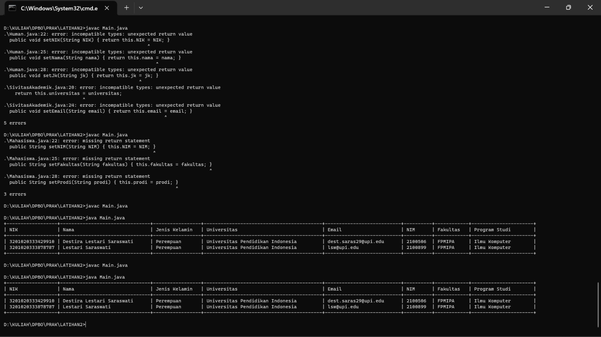

## Janji
Saya Destira Lestari Saraswati NIM 2100506 mengerjakan soal Latihan 2
dalam mata kuliah Desain Pemrograman Berorientasi Objek untuk keberkahanNya
maka saya tidak melakukan kecurangan seperti yang telah dispesifikasikan.
Aamiin.

# Tugas LATIHAN2DPBO2023
Buatlah program berbasis OOP menggunakan bahasa pemrograman C++, Java, Python, dan PHP yang mengimplementasikan konsep Multi-level Inheritance  pada kelas - kelas tersebut:
Mahasiswa: NIM, nama, jenis_kelamin, fakultas, prodi
Human: NIK, nama, jenis_kelamin
SivitasAkademik: asal_universitas, email_edu

File README berisi desain program, penjelasan alur, dan dokumentasi saat program dijalankan (screenshot/screen record, pilih salah satu bahasa sebagai contoh)

Submit link repository pada form berikut: [Form Pengumpulan](https://forms.gle/rvb1hKxbQVuYNbhKA) 

## Desain Program
Desain yang saya buat menggunakan 4 Class:
* Human
* Sivitas Akademik
* Mahasiswa
Dengan tambahan file Main

`khusus bahasa` `C++` dan `PYTHON` menambahkan class `DatabaseMahasiswa` yang dirancang untuk percobaan mentimpan data dalam bentuk vector dan list, yang kemudian program dapat menerima inputan dan memungkinkan untuk CRUD dalm program.

`Class Human` memiliki total tiga atribut:
* **NIK** -> NIK manusia, `string`
* **Nama** -> nama manusia, `string`
* **JK** -> jenis kelamin manusia, `string`

`Class SivitasAkademik` memiliki total dua atribut dan atribut dari parentnya `Class Human`:
* **universitas** -> asal Universitas sivitas akademik, `string`
* **email** -> email Edu sivitas akademik, `string`

`Class Mahasiswa` memiliki total tiga atribut dan atribut dari parentnya `Class SivitasAkademik`:
* **NIM** -> NIM mahasiswa, `string`
* **Prodi** -> program studi mahasiswa, `string`
* **Fakultas** -> Fakultas mahasiswa, `string`

_Semua Class diatas dilengkapi dengan setter dan getternya_

Pada Class class diatas dilakukan multi-level inheritance dari 

`Class Human` -> `Class SivitasAkademik` -> `Class Mahasiswa`

`Kenapa?` karena `Mahasiswa` adalah `SivitasAkademik` dan `SivitasAkademik` adalah `Human`

maka pewarisan dilakukan dari `Class Human` ke `Class SivitasAkademik` ke `Class Mahasiswa`

## Alur Program
Inputan di hardcode, kecuali untuk C++ dan Python dapat menerima inptan dan melakukan CRUD
masuk ke dalam masing-masing atribut
atribut di tampilkan dengan format tabel

## UML DIAGRAM
UML diagram yang direpresentasikan merupakan contoh dari diagram program Java.
Berikut penjelasannya:
Ada tiga kelas yaitu Human, SivitasAkademik, dan Mahasiswa.
Kelas SivitasAkademik adalah anak kelas dari Human dan memiliki dua atribut tambahan yaitu universitas dan email.
Kelas Mahasiswa adalah anak kelas dari SivitasAkademik dan memiliki tiga atribut tambahan yaitu NIM, fakultas, dan prodi.
Setiap kelas memiliki metode display() untuk menampilkan informasi yang dimilikinya.
Kelas Main hanya digunakan untuk menampilkan data dalam bentuk tabel dengan memanggil metode display() dari objek Mahasiswa.

## Dokumentasi
**Program Java**

## Catatan
- dokumentasi selain program Java tersedia dalam masing-masing folder sesuai dengan bahas program yang digunakan
- UML Diagram tersedia dalam folder `LATIHAN2`

